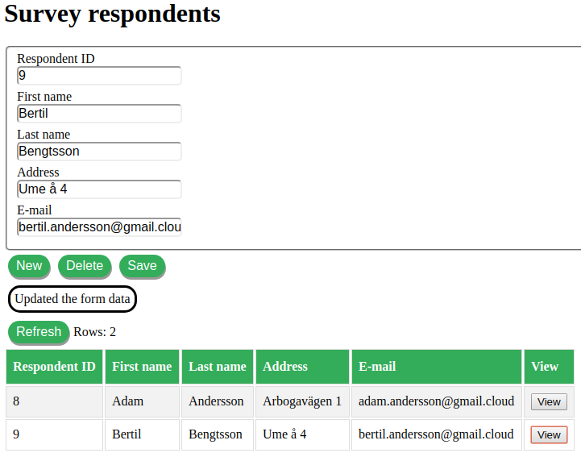

# ListDemo
A demo that show a common case where you want to register structured data in a form and display a subset of the data in a list.

Live demo [here](http://listdemo.charzam.com/Lembke/ListDemo/View/fieldsName/survey_respondents).
Same live demo with another field definition [here](http://listdemo.charzam.com/Lembke/ListDemo/View/fieldsName/todo).

## Installation
Install a LAMP system. Set up local.listdemo.se or any domain you like. Point the vhost to the folder: `public_html`.
Surf to one of therse URLs:
* http://local.listdemo.se/Lembke/ListDemo/View/fieldsName/survey_respondents
* http://local.listdemo.se/Lembke/ListDemo/View/fieldsName/todo

## Features

From the top you see the title of the form. The form itself with its fields. Note that the ID field is read only.
Then you have three buttons:
* New - clears the fields in the form
* Delete - clears an unsaved post / deletes a saved post from the database.
* Save - Inserts a new post / updates an existing post in the database.

Then you have the message box where you see what is happening.

Refresh - Loads / updates the list.

And finally the list where you see all posts. Here you can click "View" to view a post in the form fields.

## Features I will not implement in this listdemo 
* Search
* Sort on list column
* Get part of list if there are a lot of data
* Other field types than text in the form
* Update the local list with data from the registration form that have been updated/deleted.
* Cache the list in the local storage
* Field validation

## How it works
Everything start with the definition files in folder `folder/config/fields`.
Here you can have as many definition files you want.
Surf to a definition file like this:
* http://local.listdemo.se/Lembke/ListDemo/View/fieldsName/survey_respondents

A **router** pick up on your URL and calls the controller `Lembke/ListDemo/View` with data `fieldsName = "survey_respondents"`.

The **controller** calls the **generic template** `SinglePage.phtml`, and that template loads a **custom child template** in the module. `ListDemo.phtml`.

The custom template sets the basic html structure we will use, includes the javascript files needed, declares them and handles their dependency injections, and finally calls the start function in the main class.

The **main class** is declared in a variable and we will use that variable to send events to it. I could have used an abstract solution with event observers but instead I used the onclick events on the buttons. So the variable name goes into the main class.

The main class.start() function need the data from the definition file and ask the server for the data.
Then sets title, buttons, form fields. You can now use the buttons.

## Technology
The files are placed in a module structure under `folder/vendor`.
The PHP classes are loaded with an autoloader. Dependency injection is used.
The `View` folder contain the frontend things like javascript, assets, css, templates. I have used PHP to inject them into the template. Normal is to expose them on the web and download them in separare requests.

### API
URL: `http://local.listdemo.se/Lembke/ListDemo/AjaxRequest`

The API accept POST with JSON data and also return JSON data.
Normally each REST function get its own URL. Here all calls go to the same URL and it is the POST data that tell what to do.

* getList - get the full list with all posts
* setup - Set up the database and table if they do not exist
* getPost - Load a post by ID.
* putPost - create/update a post. 
    * If ID is empty or do not exist then create a new post
    * If ID exist then update the existing post with new data
* deletePost - Remove a post from the database
* getFieldsData - Get the contents from one of the definition files in `folder/config/fields`. 

### Storage
Data is stored in a MySQL/MariaDB database table and PHP use PDO to access the server.
The Storage class is custom to the module but generic in the sense that it can handle any definition file data.

### Frontend
The frontend is written in Javascript. It uses no framework.
The data from the list will NOT be used in the registration form because data could have been modified by another user in the database.

## Other
It is `.htaccess` that make all URLs go to index.php. The `.htaccess` file only work on Apache web servers. If you run another web server then you can check how to get all urls to index.php.

manifest.json - Just something I copied and modified from my other projects. It makes it possible to create a nice start icon on Android / IOS. Then the app looks and feels like a native phone app.

## License
See file LICENSE.
 